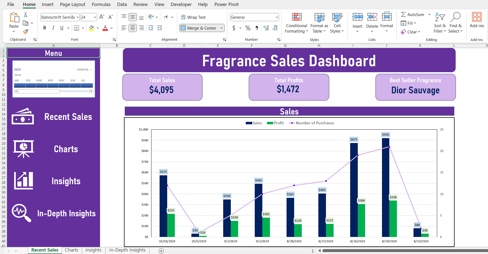
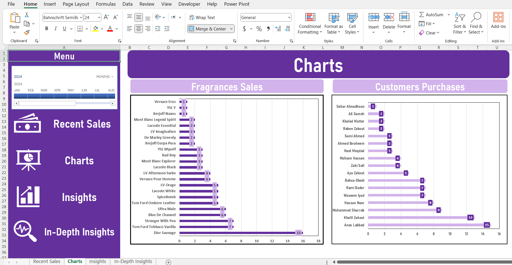
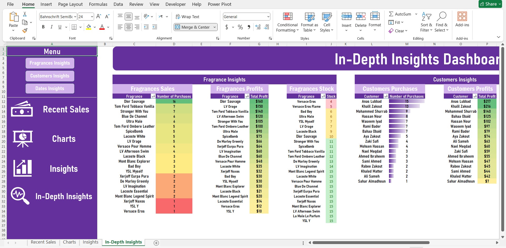

# Fragrance-Shop-System

## Overview
**Fragrance Shop Sales Management System** is an all-in-one solution tailored for fragrance retail businesses, aimed at simplifying sales tracking, inventory management, and data analysis. With an intuitive **`Python`**-based **GUI**, the system makes it easy to manage day-to-day operations, automatically track inventory, and generate insights through data analysis. Built with a focus on usability and efficiency, the system leverages **`SQLite`** for data storage, and integrates seamlessly with **`Excel`** and **`Power BI`** to provide powerful visual reporting and analytics.

## Skills Demonstrated
* **`Python`**:  Developed core functionality using Python, including database interactions, **`GUI`** design, and application logic.
* **`Tkinter`**: Designed and implemented a user-friendly interface for ease of use and efficient data entry.
* **`Database Design`**: Designed the database tables and relationships for efficient memory use, ensuring high performance and scalability.
* **`SQLite`**: Managed data storage and retrieval with **`SQLite`**, handling schema modifications and data updates.
* **`Excel`**: Leveraged Excel’s **`Power Pivot`** to create and manage **`Pivot Tables`** and **`Dashboards`** for insightful data visualization.
* **`Power BI`**: Created interactive **`Power BI Dashboards`** for comprehensive data analysis and reporting.
* **`Data Analysis`**: Utilized **`SQL`** and **`DAX`** for advanced data querying and measures to extract meaningful business insights.

## Features
**1) GUI**: Built with **`Tkinter`**, a **`Standalone`** application provides an easy-to-use interface for recording sales, managing inventory, and viewing key metrics.
  
   
  
**2) Database Integration:** Utilizes **`SQLite`** for seamless data storage and retrieval, ensuring that all sales and inventory data are securely managed.
  
**3) Real-Time Stock Updates:** Automatically adjusts stock levels with each sale, maintaining accurate inventory records.
  
**4) Excel Integration:** Connects with **`Excel Power Pivot`** for advanced data analysis, including creating **`Dynamic Pivot Tables`** and **`Dashboards`**.
  
        
  
**5) Power BI Integration:** Generates interactive dashboards in **`Power BI`** to visualize sales trends and business insights.
  
  

**6) Data Analysis:** Implements **`DAX`** measures and **`SQL`** queries to analyze sales data, identifying top and least-selling fragrances.

## Workflow
#### 1) Data Entry:
  
* **Sales Recording:** User can input customer and select fragrances using the Tkinter-based GUI. Each sale is recorded with relevant details including the customer ID, fragrance ID, and sale date. 
* **Adding Customers:** User can add new customers specifying their names, ages, and mobile phones.

#### 2) Data Storage:

* **SQLite Database:** Sales and inventory data are stored in a SQLite database. The **`Fragrances Table`** tracks inventory details such as fragrance names, prices, costs, profit, and stock levels. The **`Sales Table`** logs each transaction with unique sale IDs and timestamps, The **`Customers Table`** specifies the customer's name, age, mobile phone.

#### 3) Stock Management:

* **Real-Time Updates:** Upon recording a sale, the stock level for the corresponding fragrance is automatically decremented, ensuring that inventory counts remain accurate.

#### 4) Data Analysis:

* **Excel Integration:** Data is exported to Excel, where Power Pivot is used to create pivot tables and charts. This allows for dynamic analysis and visualization of sales data.
* **Power BI Integration:** Data is also visualized in Power BI, enabling the creation of interactive dashboards that highlight sales trends and key performance indicators.

#### 5) Reporting:

* **Dashboards:** Users can view comprehensive reports and dashboards created in Excel and Power BI. These dashboards provide insights into sales performance, top-selling fragrances, and inventory status.

## Usage
- Prerequisites: Ensure you have the following installed:
  * Python 3.x
  * Required Python libraries (Tkinter, SQLite3)
  * ODBC (Open DataBase Connectivity) for SQLite ([Download ODBC SQLite](http://www.ch-werner.de/sqliteodbc/)) 
  * Excel (for Power Pivot features)
  * Power BI (for interactive dashboards)
    
**1. Clone the Repository**
To use the program, first clone the repository to your local machine:
`git clone https://github.com/Khalil-Zakout/Fragrance-Shop-System.git`

**2. Install Dependencies**
Next, install the required dependencies using pip:
`pip install tkinter sqlite3`

**3. Run the Application**

**4. Using the System**
* **Add a Customer:**
Launch the system and navigate to the Add Customer tab.
Input the customer’s details (name, age, mobile phone).
Click Submit to save the customer details to the database.

* **Record a Sale:** Navigate to the Sales section in the GUI. Select an existing customer and fragrance from the dropdown.
  Click Submit to record the sale and automatically update the stock.

**5. Excel Dashboard:** 
- Open ODBC Administrator.
- Go **User DSN** and press **Add**.
- Choose **SQLite3 ODBC Driver** and press **Finish**.
- Choose a Name for the data source and define where your data source is and press **OK**.
- Open Excel Dashboard and go to **Data** and press **Get Data** then **From Other Sources** Then **From ODBC**.
- Choose the one you have created in the ODBC and press **OK**.
- Choose **Default or Custome** and press **Connect**.
- The dashboard now will automatically be updated as it is linked to the database.
- **NOTE**: if you have any problem updating data, press **Refresh All** from **Data**.

**6. Power BI Dashboard:**
- Open PowerBI and go to **Home** and press **Get Data** then choose **ODBC**
- Choose the same one you have created in the ODBC in the previous step and press **Connect**
- The dashboard now will automatically be updated as it is linked to the database.
- **NOTE**: if you have any problem updating data, press **Refresh** from **Home**.

## Contact
For any inquiries or feedback, please reach out to zakoutkhalil@gmail.com

